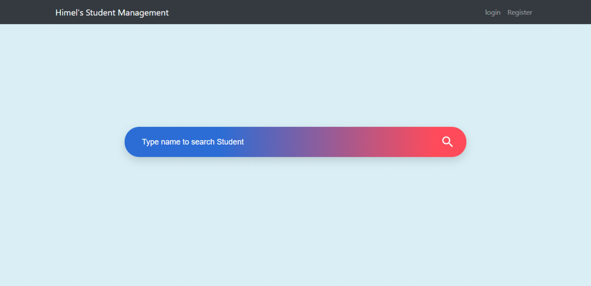

# StudentManagement
It's a Simple Student Management system using ASP.NET &amp; C# along with Bootstrap and Ajax. 

I developed this project this year in 2019 for my friend. As he asked me do a Web Project based on OOP concept. 

Microsoft dataset has been used as database. Which is integrated along with the project so you don't need to worry about database integration.  

I developed it with Visual Studio 2017 along with 4.7 .NET VERSION. There might be a warning for lower version of .NET

To run this on your PC make sure you are running windows OS and visual stuio 2013 or higher is installed and .NET version is 4.5 or higher then that. Then there will be no issue running this on your PC.

# Demo Data

admin username : mzs, password: 123

# Demo View

